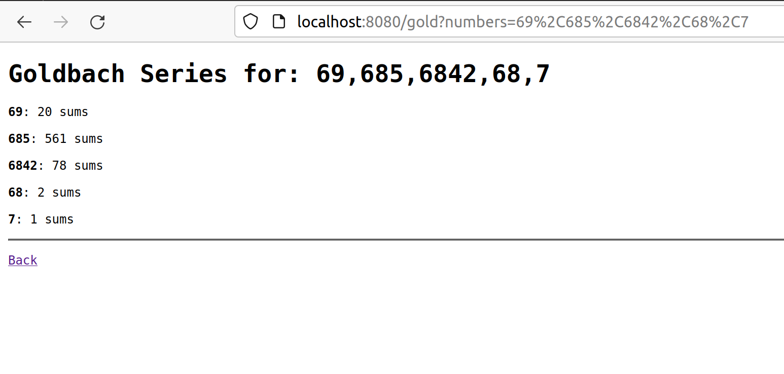
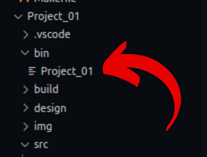
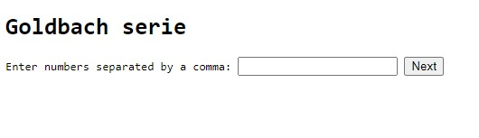
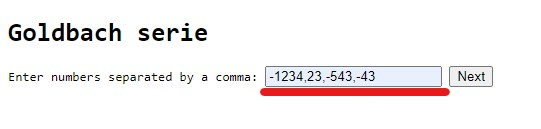
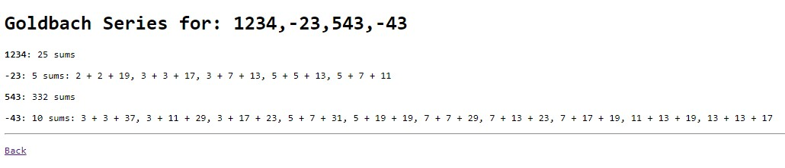

# Servidor web concurrente y distribuido

Consiste en el desarrollo de un servidor web concurrente y distribuido que
permita a sus visitantes obtener las sumas de Goldbach de números. El servidor
es capaz de aceptar y atender múltiples conexiones de manera concurrente, es
decir, el servidor recibie solicitudes de usuarios las cuales consisten de
listas de números para los cuales una aplicación realizará el cálculo de la
suma de Goldbach.



## Descripción del problema

### Servidor Web

Como es sabido, los servidores (o servicios) de software son de naturaleza
concurrente. El presente proyecto convierte a este servidor web serial en uno
concurrente para que naturalmente pueda atender varias conexiones de clientes
al mismo tiempo.

Los hilos utilizados para la concurrencia del servidor serán instancias de una
clase. Para ponerlos en funcionamiento, se deben agregar a la cadena de
producción, que no existe, puesto que el servidor es serial. Debe modificarse
la clase HttpServer para implementar un patrón productor consumidor. El
productor será el hilo principal que produce conexiones aceptadas con los
clientes, llamadas sockets que corresponden a objetos de la clase Socket. Los
consumidores de estas conexiones serán las instancias de la clase creada
(HttpConnectionHandler en este caso).

Es necesario iniciar una pequeña cadena de producción como la siguiente:

1. El hilo/objeto HttpServer sólo debe acepta solicitudes y ponerlas en cola.

2. Los hilos/objetos HttpConnectionHandler consumen las conexiones.

3. Los hilos/objetos HttpConnectionHandler extraen todas las solicitudes del
cliente, cada solicitud ensambla los objetos HttpRequest y HttpResponse pero no
atienden estas solicitudes HTTP, sino que las ponen en otra cola. Es decir, el
HttpConnectionHandler encuentra la aplicación web, que es un objeto que recibirá
la solicitud (los objetos HttpRequest y HttpResponse) y calculará las sumas de
Goldbach de cada número.

4. Un nuevo hilo consume las solicitudes HTTP de la cola anterior. Por cada
solicitud determina a cuál aplicación web va dirigida y la pone en la cola
correspondiente. El equipo de desarrollo debe determinar el rol del patrón
productor-consumidor que mejor se ajusta a esta responsabilidad.

5. Las aplicaciones consumen las solicitudes HTTP que son dirigidas hacia ellas.

6. Cada vez que la aplicación web de suma de Goldbach consuma una solicitud
HTTP, extrae los números en el cuerpo de la solicitud, pero no encuentra la suma
de Goldbach de ellos, sino que coloca estos números en cola para enviarlos al
equipo de hilos calculadores.

7. Los "calculadores", que son clases modelo, deben convertirse en hilos de
ejecución, y por lo tanto, tomar un rol del patrón productor-consumidor. Cada
vez que un "calculador" extrae trabajo de la cola, calcula las sumas de Goldbach
y el resultado es puesto en otra cola.

8. Un hilo "empaquetador" recibe las sumas y revisa si la solicitud a la que
pertenece está completa. Si lo está la pone en cola.

9. Un hilo "despachador" recibe las solicitudes que están completas, ensambla el
mensaje de respuesta HTTP y lo envía a su respectivo solicitante (navegador).

### Aplicación web orientada a objetos

La aplicación web debe estar implementada en el paradigma de programación
orientada a objetos y siguiendo el patrón modelo-vista-controlador (MVC). El
código del servidor web (controlador), la aplicación web (vista), y el cálculo
de sumas de Goldbach (modelo), deben estar en objetos separados.

La aplicación web responde con una página que tiene las sumas de Goldbach. El
servidor web produce un único mensaje de respuesta por cada solicitud HTTP del
cliente, la cual contiene todos los resultados de los números solicitados.

La aplicación permite ingresar listas de números separados por comas, positivos
o negativos, tanto en el URI (barra de direcciones del navegador), como el
formulario web. La aplicación valida entradas. Números mal formados, fuera de
rango, o entradas mal intencionadas son reportadas con mensajes de error en la
página web resultado, en lugar de caerse o producir resultados con números
incorrectos.

## Diseño

El servidor web comienza a establecer conexiones con los usuario, los cuales
son encolados en una "lista de espera" para que sean atendidos por las
instancias de la clase `HttpConectionHandler`. Esta clase es una herencia
de la clase `Consumer`, la cual se encarga de llamar a la aplicación Web
GoldbachWebApp para que esta tome el mensaje ingresado por el usuario y procese
los números con el fin de darle respuesta a el usuario.

El diseño de la solución dada puede verse explicada a detalle en el siguiente
[documento](design/design.md), de manera que se pueda entender más fácilmente.

## Manual de uso

Para poder compilar el programa debe ejecutar el comando `make` en la línea de
comandos para que el sistema operativo lea y ejecute el sript con el fin de
crear un archivo ejecutable.

```bash
make
```

Este se puede encontrar en la carpeta `bin/` con el nombre de `Project_01`.



### Ejecución

Para poder poner en marcha el programa debe ingresar por línea de comandos la
ubicación del ejecutable, ya que el programa toma los datos de la *entrada
estándar*, puede acompañar esta ubicación con el número de puerto que desee
utilizar, por ejemplo: `bin/Project_01 8080`.

El segudo parámetro indicado hace referencia a la cantidad de hilos de
ejecución que se quieran abrir, por defecto se crean tantos hilos como núcleos
existan en el procesador. Por ejemplo `bin/Project_01 8080 10` abriría 10 hilos.

Si desea conocer solamente la cantidad de sumas que contiene un número, debe
ingresar un número positivo. Por otro lado, si necesita conocer los números
que conforman dichas sumas, puede verlos ingresando un número negativo.

```bash
bin/Project_01 8080 10
```

Con tal de utilizar la página web es necesario abrir un navegador (a gusto del
consumidor), seguidamente debe dirigirse a la barra de búsqueda e ingresar
el la palabra `localhost:` seguido del número de puerto. Por ejemplo en caso de
utilizar el puerto 8080 (por defecto) es necesario ingresar `localhost:8080`.


En caso de ingresar por medio de una computadora diferente a la anfitriona
(host) debe ingresar la dirección IP del servidor seguido del número de puerto:
`127.10.132.154:8080`

Una vez aceptada la conexión aparecerá una pantalla de ingreso como
la siguiente:



Para poder conocer cantidad de sumas de un determinado número, debe ingresarlo
a través de la barra de texto. Para identificar los números que conforman estas
sumas el número ingresado debe ser un negativo.

En caso de querer ingresar más de un sólo número a la vez debe separar los
mismos con comas, sin espacios y sin letras ni caracteres especiales.



En este caso se presentará esta página de respuesta:



### Finalización del servidor

Para finalizar la ejecución del servidor puede utilizar la señal `SIGINT`, al
presionar Ctrl+C mientras se ejecuta el servidor:

```bash
  Info    request GET /gold?numbers=1234%2C-23%2C543%2C-43 HTTP/1.1
  Info    socket  connection -----closed127.0.0.1 port 54050
  ^CInfo  kill    Requested thread ID: 140514059568960
  error: could not accept client connection
  Warning webserver       Closing conections
```

O bien utilizar tanto la señal `SIGINT` como `SIGTERM` utilizando el comando
`kill PID`, donde `PID` corresponde a la identificación del proceso, puede
conocer esta mediante el comando `ps -eu`:

```bash
$ ps -ea
  PID TTY          TIME CMD
    1 ?        00:00:00 init
   30 ?        00:00:00 init
  552 ?        00:00:00 init
 2629 pts/7    00:00:00 Project_01    
```

Conociendo el PID del programa, es posible utilizar el comando `kill` en otra
terminal:

```bash
kill 2629 
```

Por defecto `kill` envía la señal `SIGTERM`, pero es posible enviar
también `SIGINT` agregando un `-2` antes del PID.

```bash
kill -2 2629 
```

### **Otras consideraciones**

* Por defecto este script realizará un ejecutable
con la capacidad de "debugueo", el cual es más ineficiente. Para obtener un el
programa más optimizado es necesario utilizar el argumento `release`.

```bash
make release 
```

* Para más información sobre la implementación de la solución del programa,
puede dar clic [aquí](design/design.md)

* Para más información sobre el uso del programa de Goldbach, sobre el cual
esta basado este proyecto, puede dar clic [aquí](design/goldbach.md)

## Rendimiento

Se comparó el rendimiento alcanzado de ambas versiones lo cual mostró los
siguientes resultados:

Los límites alcanzados con la versión anterior (serial) de este servidor
son:

```bash
$ httperf --server localhost --port 8080 --uri /gold?number=674357 --num-conns 1500 --rate 52 --num-call 4 --timeout 1
httperf --timeout=1 --client=0/1 --server=localhost --port=8080 --uri=/gold?number=674357 --rate=52 --send-buffer=4096 --recv-buffer=16384 --num-conns=1500 --num-calls=4
httperf: warning: open file limit > FD_SETSIZE; limiting max. # of open files to FD_SETSIZE
Maximum connect burst length: 1

Total: connections 1500 requests 0 replies 0 test-duration 28.828 s

Connection rate: 52.0 conn/s (19.2 ms/conn, <=1 concurrent connections)
Connection time [ms]: min 0.0 avg 0.0 max 0.0 median 0.0 stddev 0.0
Connection time [ms]: connect 0.6
Connection length [replies/conn]: 0.000

Request rate: 0.0 req/s (0.0 ms/req)
Request size [B]: 0.0

Reply rate [replies/s]: min 0.0 avg 0.0 max 0.0 stddev 0.0 (5 samples)
Reply time [ms]: response 0.0 transfer 0.0
Reply size [B]: header 0.0 content 0.0 footer 0.0 (total 0.0)
Reply status: 1xx=0 2xx=0 3xx=0 4xx=0 5xx=0

CPU time [s]: user 13.37 system 15.42 (user 46.4% system 53.5% total 99.9%)
Net I/O: 0.0 KB/s (0.0*10^6 bps)

Errors: total 1500 client-timo 0 socket-timo 0 connrefused 1500 connreset 0
Errors: fd-unavail 0 addrunavail 0 ftab-full 0 other 0
```

En cambio, el rendimiento alcanzado con esta versión concurrente del servidor
son:

```bash
$ httperf --server 10.1.137.69 --port 8080 --uri /gold?numbers=2153 --num-conns 1000 --rate 50 --num-call 40 --timeout 1
httperf --timeout=1 --client=0/1 --server=10.1.137.69 --port=8080 --uri=/gold?numbers=2153 --rate=50 --send-buffer=4096 --recv-buffer=16384 --num-conns=1000 --num-calls=40
httperf: warning: open file limit > FD_SETSIZE; limiting max. # of open files to FD_SETSIZE
Maximum connect burst length: 1

Total: connections 1000 requests 25180 replies 24800 test-duration 21.319 s

Connection rate: 46.9 conn/s (21.3 ms/conn, <=67 concurrent connections)
Connection time [ms]: min 489.5 avg 1426.0 max 1615.8 median 1491.5 stddev 210.0
Connection time [ms]: connect 0.2
Connection length [replies/conn]: 40.000

Request rate: 1181.1 req/s (0.8 ms/req)
Request size [B]: 81.0

Reply rate [replies/s]: min 1138.7 avg 1167.1 max 1197.1 stddev 24.1 (4 samples)
Reply time [ms]: response 35.6 transfer 0.0
Reply size [B]: header 103.0 content 292.0 footer 0.0 (total 395.0)
Reply status: 1xx=0 2xx=24800 3xx=0 4xx=0 5xx=0

CPU time [s]: user 2.05 system 19.24 (user 9.6% system 90.3% total 99.9%)
Net I/O: 542.2 KB/s (4.4*10^6 bps)

Errors: total 380 client-timo 380 socket-timo 0 connrefused 0 connreset 0
Errors: fd-unavail 0 addrunavail 0 ftab-full 0 other 0
```

## Créditos

### Autores

* Oscar Mario Fernandez Jimenez (oscar.fernandezjimenez@ucr.ac.cr)

* Fernando Jose Arce Castillo (fernando.arcecastillo@ucr.ac.cr)

* Alexander Sanchez Zamora (alexander.sanchezzamora@ucr.ac.cr)

### Agradecimientos

* Nekotina

* Sergio Molina
