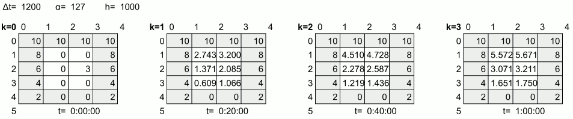
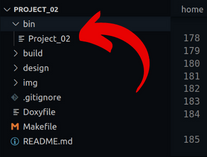
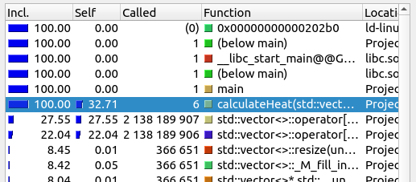
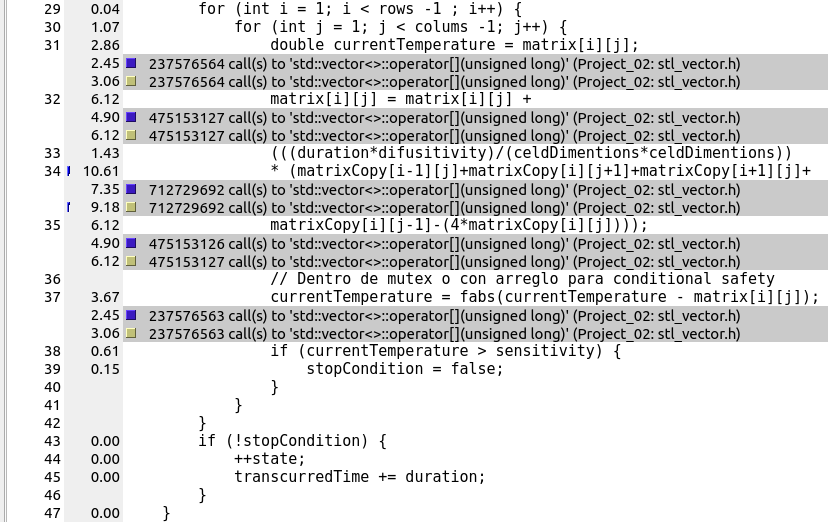
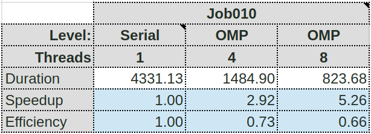
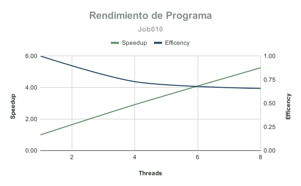
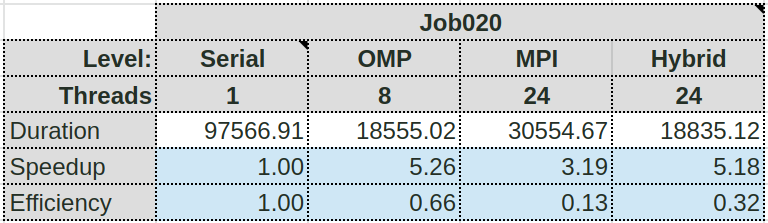
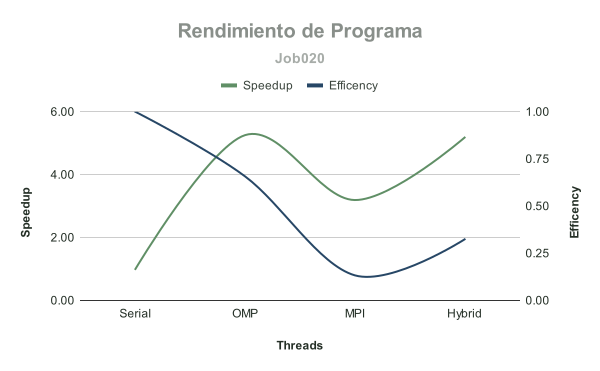

# Transferencia de calor

Consiste en una sencilla simulación por computadora que ayude a encontrar el
momento de equilibro térmico de una lámina rectangular a la que se le inyecta
calor constante por su borde. La lámina (en inglés, plate) corresponde a un
rectángulo de dos dimensiones de un mismo material. Para efectos de la
simulación, el rectángulo es dividido en *`R`* filas y *`C`* columnas ambas de
igual alto y ancho *`h`* como se ve en la Figura 1.


## Descripción del problema

### Cálculo de transferencia de calor

Cada celda de la matriz almacena una temperatura, la cual puede cambiar en el
tiempo. Se usa la notación *$T^k_{i,j}$* para indicar la
temperatura de la celda ubicada en la fila *$i$*, columna *$j$*, en el instante o
estado *$k$*. Después de transcurrido un tiempo *$Δt$*, la simulación pasará del
instante *$k$* al instante *$k+1$*, y la temperatura en la lámina habrá variado
(estado). Como es sabido, la energía se transfiere de un área más caliente hacia
una más fría. La nueva temperatura en la celda *$i,j$* será
*$T^{k+1}_{i,j}$* como se ve en la parte derecha de la Figura 1,
y puede estimarse a partir de su temperatura en el instante (o estado) anterior
y la temperatura de sus celdas vecinas por la relación:

*$$T^{k+1}_{i,j} = T^k_{i,j}+\frac{Δt⋅α}{h^2}(T^k_{i-1,j}+T^k_{i,j+1}+T^k_{i+1,j}+T^k_{i,j-1}−4T^k_{i,j})$$*

Esta fórmula nos indica que:

1. La energía que la celda *$i,j$* recibe de sus inmediaciones, se calcula como la suma
  de las temperaturas de las cuatro vecinas
  *$(T^k_{i-1,j}+T^k_{i,j+1}+T^k_{i+1,j}+T^k_{i,j-1})$*.

2. La energía que la celda pierde y se distribuye a sus cuatro celdas vecinas,
  calculada como *$−4T^k_{i,j})$*.

3. La transferencia no es instantánea, sino que depende del área que recorre.
  Entre mayor es el área de la celda, más tiempo requerirá la energía para
  desplazarse y equilibrarse con sus vecinas. Por eso la ganancia y pérdida de
  energía calculada en los dos puntos anteriores, se divide entre el área de la
  celda *$h^2$*.

4. La cantidad de energía transferida es proporcional al tiempo. Es decir, entre
  más tiempo *$Δt$* se permita entre el estado *$k$* y el estado *$k+1$*, más
  energía podrá intercambiar la celda con sus vecinas. Por esto, el intercambio
  de energía calculado en los puntos anteriores se multiplica por la duración
  del estado *$Δt$*.

5. La cantidad de energía intercambiada en el periodo de tiempo depende de la
  calidad conductora de la lámina. Materiales como la madera son lentos para
  transmitir energía, mientras que los metales son eficientes para este fin.
  Para reflejar esta realidad, el intercambio de energía calculado en los puntos
  anteriores se multiplica por la difusividad térmica, que corresponde a una
  constante *$α$* que indica a qué tasa el material logra transmitir energía desde
  un punto caliente hacia otro frío a través de él. Sus unidades son de área
  entre tiempo, como *$m^2s$* ó *$mm^2s$*. Por ejemplo, la madera tiene una
  difusividad cercana a *$0.08mm^2s$* mientras que el oro de *$127mm^2s$*, es decir,
  el oro transfiere calor aproximadamente *$1500$* veces más rápido que la madera.

### Simulación

La Figura 2 muestra cuatro instantes o estados de una simulación hipotética de
una lámina de oro (difusividad térmica *$α=127mm^2s$*). Para efectos de la
simulación, la lámina fue dividida en *$5$* filas y *$4$* columnas, cuyas celdas
son de *$h=1000mm$* de lado, es decir, de un metro de ancho por un metro de alto.

En el estado o instante cero (*$k=0$*) la simulación carga la matriz de un archivo
que indica las temperaturas iniciales de cada celda de la lámina. Es importante
resaltar que los bordes de la lámina no cambian su temperatura en el tiempo,
dado que es el punto donde los experimentadores "inyectan o retiran calor".
Por esto los bordes se resaltan con color de fondo en la Figura 2. De esta
figura puede verse que en la parte superior se inyecta calor a una temperatura
constante de 10 unidades (Celcius, Farenheit, o Kelvin), y conforme se desciende
en la lámina, se provee menos calor en los bordes.



En cada instante o estado, la simulación debe actualizar las celdas internas de
la lámina de acuerdo al modelo físico presentado en la sección anterior. En el
instante o estado *$k=1$* habrán transcurrido *$kΔt=1200s=20min$*. Como puede verse
en la Figura 2, las temperaturas en los bordes se mantienen constantes, pero
las celdas internas han adquirido energía de los bordes, en especial las celdas
en la parte superior. Sin embargo, la celda *$2,2$* perdió energía pese a que está
al lado de un borde de temperatura 6, dado que tres de sus vecinas estaban más
frías que ella en el estado previo *$k=0$*.

En el estado *$k=2$* habrán transcurrido *$kΔt=2⋅1200s=40min$*. Como puede verse en
la Figura 2, las celdas internas han incrementado lentamente su temperatura dado
a que son de *$1m^2$* cada una. Incluso la celda *$2,2$* ha visto reflejado un
incremento. En el estado *$k=3$* que en la vida real ocurriría una hora después de
que inicia el experimento, la temperatura interna sigue creciendo, pero aún no
se ha equilibrado con los valores de los bordes.

Se desea que la simulación continúe hasta que se haya alcanzado el punto de
equilibrio, lo cual ocurre cuando el calor se ha estabilizado en la lámina. Para
esto se proveerá un parámetro épsilon (*$ε$*) a la simulación, que representa el
mínimo cambio de temperatura significativo en la lámina. En cada estado *$k$* se
actualizan todas las celdas internas de la lámina. Si al menos una de las celdas
internas tiene un cambio en su temperatura mayor a *$ε$*, indica que no se ha
alcanzado aún el equilibrio y la simulación continúa con el siguiente estado
*$k+1$*, de lo contrario se detiene y reporta los resultados de la simulación. Por
ejemplo, si la simulación de la Figura 2 se corriera con un *$ε=2$* unidades de
temperatura, ésta terminaría en el estado *$k=2$*, dado que el cambio de
temperatura más grande del estado *$k=1$* a *$k=2$* se da en la celda *$1,1$*,
calculada como *$|4.51−2.74|=1.77$*, y es menor que el *$ε=2$*.

El modelo físico presentado en la sección anterior es muy sensible a los
parámetros de entrada, y dependiendo de la combinación de valores puede producir
resultados incorrectos. El modelo se acerca más a la realidad entre más celdas
se usen para representar la lámina (filas y columnas) y más pequeños sean los
cambios de tiempo (*$Δt$*). Sin embargo acercarse a la realidad impone más presión
sobre los recursos de la máquina, lo que hace la simulación más lenta, por lo
que se desea una versión paralelizada de la simulación, que pueda encontrar el
punto de equilibrio térmico en el menor tiempo posible.

## Diseño

El programa comienza analalizando los datos de entrada ingresados por el usuario,
como la ruta del archivo en entrada `jobXXX.txt`, o la cantidad de hilos.
Posteriormente, se analiza línea por línea el archivo de entrada, de manera
que se guarden todas estas  tareas o "*plates*" en un sólo vector, para su
posterior revisión. Una vez hecho esto, se dispone a separar tareas entre
procesos, donde el proceso 0 se encarga de la distribución de tareas entre el
resto de procesos de manera dinámica.

Cada proceso recibe un número que hace referencia a la posición de uno de los
*plates* que se encuentran en el vector, de este *plate* se toma la ruta del
archivo binario de la cual se leen los datos relativos a la matriz y se procede
a realizar los cálculos de cada de cada matriz para encontrar su equilibrio
térmico, una vez terminados los cálculos, estos se escriben en un archivo .tsv
del mismo nombre que el archivo de entrada. Asimismo, el estado de la matriz se
uarda en un archivo binario llamado `jobXXX-n.bin`, donde *n* corresponde al
número de estados utilizados. Todos estos archivos se encuentran en una carpeta
de salida llamada *output*.

Este proceso ser repite hasta que se acaban las tareas, momento en el cual el
proceso 0 comienza a enviar condiciones de parada a todos los procesos. El diseño
de la solución dada puede verse implementada a más alto nivel en la carpeta
design, escrito en pseudocódigo, de manera que se pueda entender más fácilmente.

## Manual de uso

Para poder compilar el programa debe ejecutar el comando `make` en la línea de
comandos para que el sistema operativo lea y ejecute el sript con el fin de
crear un archivo ejecutable.

```bash
make
```

Este se puede encontrar en la carpeta `bin/` con el nombre de `Project_01`.



Con el fin de utilizar la tecnología de comunicación entre procesos MPI, es
necesaria su previa instalación. En caso de no tener esta tecnología instalada
puede obtenerla mediante el comando:

```bash
sudo apt install mpich
```

o bien

```bash
sudo apt install openmpi-bin
```

Estas son implementaciones de la misma tecnología MPI, sin embargo es necesario
resaltar que ambas implementaciones **no** pueden instalarse en el mismo
dispositivo, por lo que debe utilizarse sólo uno de los comandos anteriores. En
caso de necesitar desinstalar una de estas implementaciones puede hacerlo
mediante el comando

```bash
sudo apt autoremove <implementación>
```

En caso de probar el programa en arenal, debe asegurarse de que estas
implementaciones estén habilitadas, puede hacerlo ejecutando el comando `module`.
A partir de este comando puede utilizar los siguientes argumentos:

* **list:** Utilizado para listar los módulos habilitados actualmente.

```bash
$ module list
Currently Loaded Modulefiles:
  1) null                       2) development/python-3.9.7   3) compilers/gcc-9.4.0
```

* **avail:** Utilizado para listar los módulos disponibles no instalados
actualmente.

```bash
$ module avail

-------------------------------- /usr/share/Modules/modulefiles ---------------------------------
dot              module-info      null             opt-python       rocks-openmpi_ib
module-git       modules          opt-perl         rocks-openmpi    use.own

--------------------------------------- /etc/modulefiles ----------------------------------------
mpi/openmpi-x86_64

--------------------------------- /share/apps/tools/modulefiles ---------------------------------
compilers/gcc-9.4.0      mpi/mpich-3.2.1
development/python-3.9.7 mpi/openmpi-4.1.1
```

* **add:** Utilizado para añadir un módulo instalado.

```bash
module add mpi/mpich-3.2.1
```

* **purge:** Utilizado para deshabilitar todos los módulos instalados.

```bash
module purge
```

Si se desea distrbuir la cantidad de proceso utilizados entre varios dispositivos,
estos deben especificarse en un archivo llamado `hosts-mpich` en caso de utilizar
la implementación *MPICH* o `hosts-openmpi` en caso de utilizar *OpenMPI*. Estos
archivos deben encontrarse en la carpeta de ejecución del programa. En este
documento debe indicar el nombre de los dispositivos, separados por saltos
de línea:

En caso de utilzar *MPICH*, la sintáxis sería

```text
compute-0-0:1
#compute-0-1:1
compute-0-2:1
compute-0-3:1
```

El símbolo *#* denota un comentario, por lo que el dispositivo `compute-0-1:1`
no se toma en cuenta para la distribución de procesos. En caso de utilizar
*OpenMPI* debe utilzarse la sintáxis:

```text
compute-0-0 slots=1
#compute-0-1 slots=1
compute-0-2 slots=1
compute-0-3 slots=1
```

El número indicado a la derecha del nombre del dispositivo (`:1` en el caso de
*MPICH* y `slots=1` en *OpenMPI*), especifica la cantidad de procesos que se
asignan en esa máquina por ciclo, en este caso se asigna un solo proceso por
ciclo a cada máquina. Por ejemplo, si se abren 5 procesos se asignaría un proceso
a cada máquina en el primer ciclo y en el segundo ciclo, se asignaría un segundo
proceso a las computadoras 0 y 2, de modo que las computadoras 0 y 2 realizarían
2 procesos cada una, mientras que la máquina 3 sólo realizaría un proceso.
Cabe resaltar que estos archivos no tiene extensión, por lo que no debe indicarse
ninguna.

### Ejecución

Para poder poner en marcha el programa debe ingresar por línea de comandos la
ubicación del ejecutable, además debe ingresar como primer parámetro la ruta
hacia el **archivo de trabajo** (*job file*), archivo de texto que lista varias
láminas y los parámetros de simulación que los de cada una de ellas. Por
ejemplo:

```bash
bin/Project_02 job001.txt
```

Asimismo si desea que el programa se ejecute con una determinada cantidad de
hilos para realizar los cálculos de las sumas, puede indicarlo como segundo
argumento en la ejecución del comando, por ejemplo, la siguiente manera el
programa se ejecutará utilizando 4 hilos:
Por defecto se crean tantos hilos como núcleos existan en el procesador, por lo
que este es un parámetro opcional. Por ejemplo para abrir 10 hilos, sería:

```bash
bin/Project_02 job001.txt 10
```

Este proyecto implementa la tecnología MPI (Message Passing Interface), por lo
que puede ejecutarse utilizando varios procesos a la vez. Con tal de utilizar
más de un sólo proceso para realizar los cálculos debe utilizar una de las
implementaciones ya mencionadas, ya sea de *OpenMPI* o *MPICH*:

Para ejecutar el programa con una cantidad $w$ de procesos debe introducir el
siguiente comando:

```bash
mpiexec -np w bin/goldbach_openmp_mpi args
```

Ahora bien, estos procesos se crean en una sóla máquina, para poder distribuir
estos procesos entre varios nodos se debe utilizar el argumento `-h` o bien
`--hostfile` dependiendo de la implementación de MPI que se utilice:

En caso de utilizar *MPICH* el comando para ejecutar $w$ procesos distribuidos
entre los 3 nodos esclavos de arenal sería:

```bash
mpiexec -np w -f hosts-mpich bin/goldbach_openmp_mpi args
```

Si, por el contrario está haciendo uso de *OpenMPI*, entonces su equivalente
sería:  

```bash
mpiexec -np w --hostfile hosts-openmpi bin/goldbach_openmp_mpi args
```

Con el fin de que estos procesos se distribuyan entre los nodos esclavos, este
comando debe ejecutarse en el nodo maestro. Además, es necesario crear al menos
2 procesos para el correcto funcionamiento del programa.

### **Otras consideraciones**

* Por defecto este script realizará un ejecutable
con la capacidad de "debugueo", el cual es más ineficiente. Para obtener un el
programa más optimizado es necesario utilizar el argumento `release`.

```bash
make release 
```

* Para más información sobre la implementación de la solución del programa,
puede dar clic [aquí](design/design.md)

## Análisis de Rendimiento

### **Rendimiento con job010**

Primeramente se comienza por medir el rendimiento con una versión serial del
programa, utilizando la prueba `job010.txt`. De este modo se mide el tiempo de
ejecución del programa, así como la determinación de instrucciones que generan
alto consumo de CPU, mediante la herramienta Callgrind.



En esta imagen se puede apreciar cómo las instrucciones que generaron más consumo
de tiempo de CPU fueron *main* y *calculateHeat*. El *main* actúa como controlador,
de modo que es normal que sea una de las intrucciones más usadas.

A partir de esta prueba se determina que la instrucción con más consumo de
recursos es el cálculo de la temperatura, esto debido a que debe realizarse
*$n⋅w$* cantidad de veces, donde *$n$* es la cantidad de celdas especificadas en
la matriz y *$w$* la cantidad de estados requeridos para llegar a un equilibrio
térmico. Esta idea es corroborada por Callgrind:



Es en este proceso que se paraleliza el código, utilizando la tecnología OpenMP
para distribuir los ciclos entre la cantidad de hilos. Una vez terminado se dispone
una segunda y tercera prueba para determinar la mejora de rendimiento, los datos
obtenidos se reportan en una tabla.



Estos datos pueden visualizarse con el más fácilmente con el siguiente gráfico:



Las pruebas se realizaron con *$4$* y *$8$* hilos. Como puede observarse hay un
incremento de velocidad de hasta *$5$* veces más veloz que la versión serial
utilizando *$8$* hilos, sin embargo, hay un equilibrio entre velocidad y
eficiencia si se utilizan *$6$* hilos.

Esto es aún más evidente cuando se comparan los tiempos de ejecución.


### **Rendimiento con job020**

En esta prueba se realiza una comparación entre el rendimiento de OpenMP contra
una versión híbrida del código, la cual utiliza tanto OpenMP como distribución
MPI.

Primero se procede a medir el tiempo de ejecución, de manera que se pueda analizar
el rendimiento posteriormente, estos datos se reportan en una tabla.




Los cálculos obtenidos pueden visualizarse en el siguiente gráfico.



Como puede observarse la versión de OpenMP mantiene su speedup de manera consistente,
pero se puede observar un fenómeno cuando se corre con MPI; el programa es más
ineficiente si se corre con 24 procesos, cada uno con hilo. Esto puede deberse a
que cada proceso debe lidiar con cálculos matemáticos robustos, con un sólo hilo,
de modo que si bien las tareas se reparten entre varios procesos, cada proceso
debe calcular las temperaturas de manera serial. Sin mencionar que el rendimiento
de la máquina disminuye al tener que abrir muchos más hilos que la cantidad de
núcleos posea la computadora.

Esta idea puede respaldarse al ejecutar la segunda prueba híbrida, donde cada
proceso tiene 8 hilos, lo que permite paralelizar los cálculos de las temperaturas.
Por otra parte se puede apreciar que no existe mucha diferencia entre la prueba
de OpenMP comparado con la prueba híbrida, y esto es esperable, puesto que esta
prueba se realizó con solamente dos computadoras, ya que una de ellas no estaba
disponible. De este modo, un proceso se encargaba del mapeo, mientras que el otro
se encargaba de todos los cálculos, lo que escencialmente, es lo mismo que realiza
la prueba de OpenMP. Es probable que el programa fuera más eficiente si se ejecuta
la prueba utilizando 3 computadoras.

## Créditos

### Autores

* Oscar Mario Fernandez Jimenez (oscar.fernandezjimenez@ucr.ac.cr)

* Fernando Jose Arce Castillo (fernando.arcecastillo@ucr.ac.cr)

* Alexander Sanchez Zamora (alexander.sanchezzamora@ucr.ac.cr)
